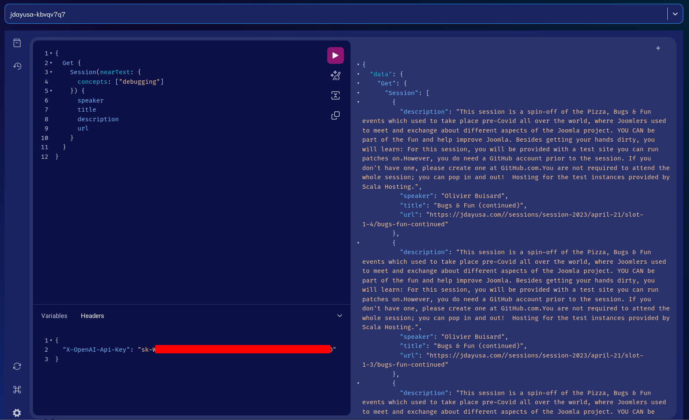

# Joomla + Weaviate - Semantic search

Demo for my [Adding AI-powered semantic search to your Joomla site](https://jdayusa.com/sessions/session-2023/april-22/slot-2-4/adding-ai-powered-semantic-search-to-your-joomla-site) at JDayUSA 2023.


## Usage

1. Set up the project:
   ```bash
   git clone https://github.com/dandv/jdayusa-weaviate
   cd jdayusa-weaviate
   npm install

2. Optionally update the sessions JSON file. The `sessions.json` from the repo is up-to-date as of 2023-April-13.
   ```bash
   npm run parse  # updates sessions.json from jdayusa.com/sessions

3. Create a Weaviate instance. This can be as simple as running the single-executable Linux binary from the [latest release](https://github.com/weaviate/weaviate/releases), or signing up for a [free Weaviate Cloud Services sandbox](https://console.weaviate.cloud), or running a [Docker container](https://weaviate.io/developers/weaviate/installation) locally.

4. Create a `.env` file in the project directory with the following keys:
   ```text
   OPENAI_APIKEY=...get this from https://platform.openai.com/account/api-keys...
   # The following two keys are only necessary if you use WCS; not if using Docker
   WEAVIATE_HOST=...sign up at https://console.weaviate.cloud and paste the host here (without https)...
   WEAVIATE_API_KEY=...get the Admin key from Weaviate Cloud Services...
   ```

   * Take note of the Weaviate cluster hostname, e.g. `localhost:8080` for Docker or `jdayusa-ctv1de32.weaviate.network` if using WCS. Store this in the `.env` file as the `WEAVIATE_HOST`.

   * For WCS, click on the cluster Details then the key 🔑 icon and copy the Admin key. Store it as `WEAVIATE_API_KEY` in the `.env` file.

5. Create the Weaviate schema and import the data from the JSON file
   ```bash
   npm run ingest

You can now run semantic queries via the GraphQL IDE provided by the Weaviate Cloud Services console. You'll need to add your OpenAI API key in the Variables section:


